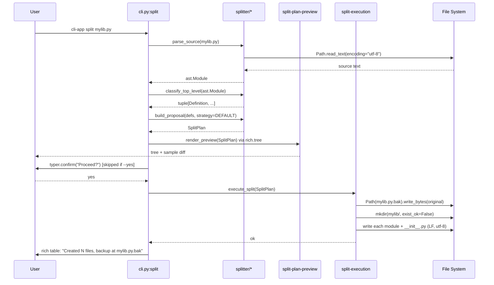
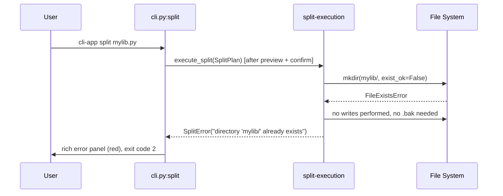
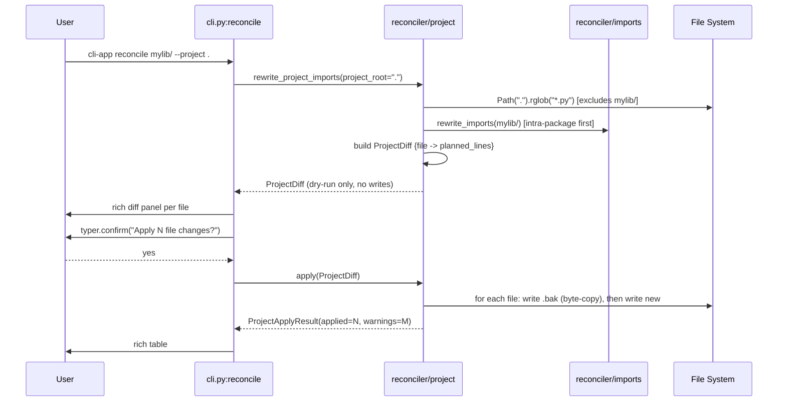

# Design: Python Code Splitter/Reconciler

## Architecture Overview

The `python-splitter` change delivers a Typer CLI (`cli-app`) that splits monolithic Python files into structured packages and reconciles their imports. The architecture is a four-stage pipeline — **parse → propose → preview → split/reconcile** — built almost entirely on the Python stdlib (`ast`, `pathlib`, `astunparse` is intentionally NOT used). `typer` provides the command surface, `rich` renders previews, and the splitter/reconciler engines are pure functions that take paths in and return dataclasses out, with the CLI layer being the only place that does I/O orchestration.

The flow is deliberately **AST-proposes-user-confirms** (Engram `architecture/splitter-strategy`): nothing is written to disk until the user explicitly confirms a rendered preview, and the original file is byte-copied to `{filename}.bak` first so a single restore operation can undo the whole split. The reconciler has two scopes — intra-package (always) and project-wide (opt-in via `--project`) — to keep the first cut's blast radius small.

## Module Structure

Mirrors the AGENTS.md layout. New files only; no existing `src/` to modify.

```
src/cli_app/
├── __init__.py             # public API: re-exports SplitPlan, run_split, run_reconcile
├── __main__.py             # #!/usr/bin/env python3 + from cli_app.cli import app; app()
├── cli.py                  # typer.Typer instance + split/reconcile commands
├── splitter/
│   ├── __init__.py
│   ├── parser.py           # parse_source() -> ast.Module; classify_node() -> DefinitionKind
│   ├── classifier.py       # classify_top_level() -> tuple[Definition, ...]
│   └── proposal.py         # build_proposal() -> SplitPlan  (default type-based grouping)
├── reconciler/
│   ├── __init__.py
│   ├── imports.py          # rewrite_imports() -> tuple[Path, str]  (intra-package)
│   ├── references.py       # detect_unresolved() -> tuple[str, ...]
│   └── project.py          # rewrite_project_imports() -> ProjectDiff  (--project pass)
└── _internal/
    ├── __init__.py
    ├── paths.py            # resolve_source(), package_dir_for()
    ├── backup.py           # write_backup(), restore_backup()  (byte-copy)
    └── confirm.py          # confirm_or_exit(yes: bool) -> None  (typer.confirm wrapper)
tests/
├── unit/
│   ├── test_classifier.py
│   ├── test_proposal.py
│   ├── test_imports.py
│   ├── test_references.py
│   └── test_backup.py
├── integration/
│   ├── test_split_happy_path.py
│   ├── test_split_rollback.py
│   ├── test_reconcile_intra_package.py
│   ├── test_reconcile_project_flag.py
│   └── fixtures/           # SQLAlchemy, attrs, Pydantic patterns (per sdd-apply task)
└── conftest.py
```

## Data Flow

### `split` command — happy path



### `split` command — error path (target dir already exists, REQ-SEX-001)



### `reconcile mylib/` — happy path (no `--project`)

```mermaid
sequenceDiagram
    participant U as User
    participant CLI as cli.py:reconcile
    participant IR as reconciler/imports
    participant FS as File System

    U->>CLI: cli-app reconcile mylib/
    CLI->>IR: rewrite_imports(mylib/)
    IR->>FS: for each .py in mylib/: read (utf-8)
    IR->>IR: ast.walk; for each cross-ref: emit from .X import Y
    IR->>IR: detect_unresolved() -> warnings tuple
    IR->>FS: write modified files (LF, utf-8)
    IR-->>CLI: ReconcileResult(writes=N, warnings=M)
    CLI->>U: rich table: "N imports rewritten, M warnings"
```

### `reconcile mylib/ --project .` — opt-in global rewrite (REQ-EXT-002 / REQ-EXT-003)



## Data Model

```python
from __future__ import annotations
from dataclasses import dataclass
from enum import StrEnum
from pathlib import Path

class DefinitionKind(StrEnum):
    CLASS = "class"
    FUNCTION = "function"
    CONSTANT = "constant"
    IMPORT_BLOCK = "import_block"
    UNCLASSIFIED = "unclassified"

@dataclass(frozen=True, slots=True)
class Definition:
    name: str
    kind: DefinitionKind
    lineno: int
    end_lineno: int
    source_segment: str           # verbatim text from ast.get_source_segment

@dataclass(frozen=True, slots=True)
class ModuleProposal:
    filename: str                 # e.g. "models.py" — no path component
    definitions: tuple[Definition, ...]

@dataclass(frozen=True, slots=True)
class SplitPlan:
    package_name: str             # e.g. "mylib"
    source_path: Path
    modules: tuple[ModuleProposal, ...]
    warnings: tuple[str, ...]     # non-blocking, e.g. "unclassified: class inside conditional at line N"

@dataclass(frozen=True, slots=True)
class ReconcileResult:
    package_dir: Path
    files_written: tuple[Path, ...]
    warnings: tuple[str, ...]

@dataclass(frozen=True, slots=True)
class ProjectDiff:
    project_root: Path
    changes: tuple[tuple[Path, str, str], ...]   # (path, original_text, new_text) per file

@dataclass(frozen=True, slots=True)
class ProjectApplyResult:
    applied: tuple[Path, ...]
    backups: tuple[Path, ...]
    warnings: tuple[str, ...]
```

Backup file naming: `{source_stem}.py.bak` adjacent to the source (REQ-SEX-001, REQ-SEX-003). For `--project` rewrite, backups are `{rel_path}.bak` next to each modified file.

## Module Contracts

### `splitter/parser.py`
```python
def parse_source(path: Path) -> ast.Module:
    """Read path with encoding='utf-8' and ast.parse(source, type_comments=True).
    Raises FileNotFoundError, SyntaxError, UnicodeDecodeError."""
```

### `splitter/classifier.py`
```python
def classify_node(node: ast.stmt) -> Definition:
    """Map a single top-level stmt to Definition. Decorated ClassDef/FunctionDef
    keep their kind (REQ-ABD-001). If/Expr/AsyncFunctionDef inside unknown wrappers
    return kind=UNCLASSIFIED (REQ-ABD-002)."""

def classify_top_level(tree: ast.Module) -> tuple[Definition, ...]:
    """Walk tree.body in order. Return tuple preserving source order within each kind."""
```

### `splitter/proposal.py`
```python
DEFAULT_STRATEGY: Final[str] = "type_based"

def build_proposal(
    definitions: tuple[Definition, ...],
    strategy: str = DEFAULT_STRATEGY,
) -> SplitPlan:
    """Group definitions by kind. type_based yields:
        models.py  <- classes
        functions.py <- functions
        constants.py <- constants
        imports.py <- import_block (at most one)
    Unclassified definitions each get their own module:
        unclassified_<sanitized_name>.py
    Emits warnings for unclassified items (REQ-ABD-002) and for empty input (REQ-ABD-003)."""
```

### `reconciler/imports.py`
```python
def rewrite_imports(
    package_dir: Path,
    original_module: str,
    symbol_to_module: dict[str, str],
) -> ReconcileResult:
    """For each *.py in package_dir, read utf-8, AST-walk Name/Attribute references,
    rewrite `from original_module import X` to `from .X_module import X` when X is in
    symbol_to_module. Other imports untouched (REQ-IRC-003). Writes LF, utf-8."""

def symbol_to_module_map(plan: SplitPlan) -> dict[str, str]:
    """Build the {symbol_name: submodule_filename} map from a SplitPlan."""
```

### `reconciler/references.py`
```python
def detect_unresolved(
    package_dir: Path,
    defined_symbols: frozenset[str],
) -> tuple[str, ...]:
    """Walk each .py, collect Name/Attribute targets not in defined_symbols and not
    in stdlib/known-third-party. Return formatted warning strings (REQ-IRC-002)."""
```

### `reconciler/project.py`
```python
def rewrite_project_imports(
    package_dir: Path,
    project_root: Path,
    original_module: str,
    symbol_to_module: dict[str, str],
) -> ProjectDiff:
    """Path(project_root).rglob('*.py'), skipping anything under package_dir.
    For each file, find `from {original_module} import X` and `import {original_module}`
    where X has a known target. Return a ProjectDiff — NO writes (REQ-EXT-002, REQ-EXT-003)."""

def apply_project_diff(diff: ProjectDiff) -> ProjectApplyResult:
    """Write .bak byte-copy FIRST per file, then write new content. LF, utf-8.
    If any write fails, restore that file's backup before propagating the error."""
```

### `_internal/backup.py`
```python
def write_backup(source: Path) -> Path:
    """Path.read_bytes() -> Path(source).with_suffix(source.suffix + '.bak').write_bytes()."""
def restore_backup(backup: Path, original: Path) -> None:
    """Reverse of write_backup. Used by split-execution on mid-split failure (REQ-SEX-003)."""
```

### `_internal/paths.py`
```python
def package_dir_for(source: Path, output_dir: Path | None) -> Path:
    """If output_dir is None, return source.parent / source.stem. Else output_dir / source.stem.
    Refuses to return a path that already exists (caller raises SplitError)."""
```

### `_internal/confirm.py`
```python
def confirm_or_exit(message: str, yes: bool) -> None:
    """If yes: return. Else typer.confirm(message, abort=True, default=False)."""
```

### `cli.py`
```python
app: typer.Typer

@app.command()
def split(
    source: Path,
    yes: bool = typer.Option(False, "--yes", "-y"),
    output_dir: Path | None = typer.Option(None, "--output-dir"),
) -> None:
    """Split a monolithic Python file into a structured package."""

@app.command()
def reconcile(
    package_dir: Path,
    project: Path | None = typer.Option(None, "--project"),
) -> None:
    """Rewrite intra-package imports; optionally rewrite imports across a project."""
```

## Dependency Choices

| Concern | Choice | Why (vs alternatives) |
|---|---|---|
| CLI framework | `typer` | AGENTS.md mandates Typer. Type-hint driven, rich auto-dep, cross-platform. `argparse` is stdlib-only territory (rejected per AGENTS.md). `click` is framework-agnostic, not needed. |
| Output | `rich` | AGENTS.md mandates rich for tables/trees/panels. Auto-ANSI-fallback on Windows. No `colorama` needed. |
| AST | `ast` (stdlib) | First cut: stdlib is enough for top-level classification. See ADR-001. |
| Source regeneration | `ast.unparse` (3.9+) | Stdlib, preserves syntax for the rewritten file. Avoids `astunparse` (3rd-party, stale) and `libcst` (heavy dependency, not justified for first cut). |
| Diff display | `rich.syntax.Syntax` + `difflib.unified_diff` | Both stdlib. `rich` renders colored output. Avoids `rich-diff` or `yattag`. |

No third-party AST library is added in this change. `astroid` and `libcst` are documented as future options in ADR-001 if scope grows to handle try/except-wrapped definitions or exec()-generated code.

## Testing Strategy

| Layer | What to Test | Files | Approach |
|---|---|---|---|
| Unit | `classify_node` for ClassDef/FunctionDef/AsyncFunctionDef/Assign/If-wrapped/Expr, `build_proposal` grouping, `symbol_to_module_map`, `detect_unresolved` | `tests/unit/test_classifier.py`, `test_proposal.py`, `test_imports.py`, `test_references.py`, `test_backup.py` | Pure dataclass in/out, no I/O, `ast.parse` on inline strings |
| Integration | `split` end-to-end on tmp_path, `split` rollback on mid-write failure (mock `Path.write_text` to raise), `reconcile` intra-package, `reconcile --project` with diff preview + apply | `tests/integration/test_split_happy_path.py`, `test_split_rollback.py`, `test_reconcile_intra_package.py`, `test_reconcile_project_flag.py` | `tmp_path` fixture (AGENTS.md), real files, real `typer.testing.CliRunner` |
| Fixtures | SQLAlchemy declarative patterns, attrs `@define`, Pydantic `BaseModel`, `if TYPE_CHECKING` blocks, `__all__` declarations | `tests/fixtures/` | Static `.py` files referenced by parametrized integration tests (per sdd-apply task) |

Coverage target: 80% lines per AGENTS.md, configured in `[tool.coverage.report]`. No `pragma: no cover` without a justifying comment. **No `@pytest.mark.skipif(sys.platform == 'win32')`** — AGENTS.md prohibits it.

## Cross-Platform Decisions

| Decision | AGENTS.md Rule Honored | Concrete |
|---|---|---|
| All path ops use `pathlib.Path` | "Use `pathlib.Path`, never string concat" | `Path(source).with_suffix(...)`, `Path(root).rglob("*.py")` |
| All `open`/`read_text`/`write_text` pass `encoding="utf-8"` | "Always pass `encoding='utf-8'`" | `_internal/backup.py` and every `Path.read_text`/`write_text` call site |
| New `__main__.py` starts with `#!/usr/bin/env python3` | "Executable Python entry points MUST have shebang" | First line of `src/cli_app/__main__.py` |
| `__main__.py` and `cli.py` use `[project.scripts]` entry point | "Entry points under `[project.scripts]`" | `pyproject.toml` registers `cli-app = "cli_app.cli:app"` |
| Module files written LF only | "All text files MUST be LF" | `Path.write_text(content, encoding="utf-8", newline="\n")`; backup is byte-copy so original line endings are preserved for restore |
| No `os.chmod` for executable bit | "Set executable bit via git" | Not touched; `pyproject.toml` entry point handles Linux execution |
| No `subprocess.run(shell=True)` | "Never use `shell=True`" | Tool never spawns subprocesses in first cut |
| `tmp_path` fixture in tests, not `mkdtemp` | "Use `Path` for tmp dirs" | All integration tests accept `tmp_path: Path` |

## Architecture Decision Records

### ADR-001: Use `ast` (stdlib) over `astroid`/`libcst` for the first cut

**Context.** We need to classify top-level Python definitions and rewrite imports. Three viable options: (a) stdlib `ast` + `ast.unparse`, (b) `astroid` (used by pylint, has inferred types and scope analysis), (c) `libcst` (Concrete Syntax Tree, preserves formatting). All are maintained; `astroid` and `libcst` are third-party deps that increase the install footprint and add supply-chain surface.

**Decision.** Use stdlib `ast` + `ast.unparse` (Python 3.9+). The first cut only requires: (i) walking `ast.Module.body`, (ii) detecting top-level `ClassDef` / `FunctionDef` / `AsyncFunctionDef` / `Assign` / `Import` / `ImportFrom` / `If` / `Expr`, (iii) `ast.unparse` to regenerate intra-package imports. None of these need scope analysis or formatting preservation.

**Consequences (positive).** Zero new dependencies for the core engine. `pyproject.toml` stays at just `typer` + `rich`. Cross-platform behaviour is identical to CPython. mypy strict mode has full type info for `ast`.

**Consequences (negative).** Try/except-wrapped class definitions and `exec()`-generated code land in `unclassified` and require manual user intervention. Comments and blank-line formatting inside moved definitions are not preserved verbatim (we use `ast.get_source_segment`, which captures the original source range). We will document this as a known limitation and treat `astroid`/`libcst` adoption as a future change if user demand justifies the dependency cost.

### ADR-002: Hybrid AST-proposes-user-confirms flow

**Context.** The user could let the tool run unsupervised (full auto), require a dry-run preview before writes (current AGENTS.md and proposal default), or refuse to make any decisions (fully manual). The risk of a fully-auto tool is that boundary mistakes silently break the user's code; the cost of fully-manual is that the tool offers little value over `git mv`.

**Decision.** Hybrid: `ast` proposes the layout → the CLI renders a `rich.tree` preview and a sample diff → the user is prompted with `typer.confirm(..., default=False)` → only on explicit `yes` does anything get written. `--yes` / `-y` skips the prompt for scripted use. The original file is byte-copied to `.bak` before the first write so a single restore undoes the whole operation.

**Consequences (positive).** Matches the user's explicit selection (Engram `architecture/splitter-strategy`, obs #1825). No silent destruction. The `--yes` flag preserves CI/script-friendliness. The `.bak` invariant is simple to test.

**Consequences (negative).** Interactive prompt blocks unattended runs unless `--yes` is passed. The preview is only a sample diff (REQ-SPP-002) — full N-module diffs would clutter the terminal. Rollback is manual (user runs `mv mylib.py.bak mylib.py`), not automatic.

### ADR-003: Typer + rich for the CLI surface

**Context.** AGENTS.md names Typer as the default CLI framework and `rich` as the formatting tool. The project also has a long-term cross-platform baseline (Windows dev, Linux deploy). Alternative stacks: `click` + `colorama` + `tabulate`; `argparse` + `colorama`; or `textual` for a TUI.

**Decision.** `typer` + `rich`, per AGENTS.md. Single `typer.Typer()` instance in `cli.py`; subcommands `split` and `reconcile` registered via `@app.command()`. Rich handles tree/table/panel output and auto-degrades on non-ANSI Windows terminals.

**Consequences (positive).** AGENTS.md compliance. `rich` is already a Typer transitive dep, so the dep delta is essentially just `typer` (rich comes for free). Type hints drive `--help` and parsing. Cross-platform ANSI fallback is handled by `rich` itself.

**Consequences (negative).** Coupling the CLI to `rich` means command output is not pure text — CI logs need a TTY or `NO_COLOR=1`. Acceptable because the preview/diff is fundamentally a visual artefact.

## Risk Register

| ID | Risk | Likelihood | Mitigation | Source |
|---|---|---|---|---|
| R1 | `if TYPE_CHECKING:` blocks, decorated `__all__`, `exec()`-generated code land in `unclassified` | Medium | Documented contract: unclassified bucket gets its own module per item, warning emitted to stderr; user can manually merge. Fixtures for SQLAlchemy/attrs/Pydantic added in sdd-apply. | sdd-spec |
| R2 | REQ-EXT-002 `--project` scope ambiguous (walk single package vs monorepo vs tree) | Medium | Resolved in this design (see "Resolved Questions" below). Bounded: rglob `*.py` under `--project` root, skip the package itself, do not enter string-based dynamic imports. | sdd-spec |
| R3 | AST `unparse` drops comments inside moved definitions | Medium | Use `ast.get_source_segment` for the verbatim source range; only `unparse` for the small new `from .X import Y` import lines we inject. | design |
| R4 | Mid-split write failure leaves the user with partial output | Low | `.bak` written first; on exception, `restore_backup` + rmtree of partial package dir (REQ-SEX-003). Integration test simulates `OSError` on second write. | proposal |
| R5 | `rich` ANSI escape codes corrupt Windows logs without TTY | Low | Rich auto-falls back; we set `force_terminal=False` only if a `--no-color` env var is honored (out of scope for v1, documented). | AGENTS.md |
| R6 | Chained PR budget (400 lines) tight for 6 new modules + tests | Medium | Forecasted in sdd-tasks; split delivery into PR-1 (splitter engine + tests), PR-2 (reconciler engine + tests), PR-3 (CLI + integration tests). | session preflight |

## Resolved Questions

### Q1 (from sdd-spec REQ-EXT-002): What is the exact behavior of the `--project` flag?

**Resolution.** The `--project <path>` flag, when passed to `reconcile`, walks the directory tree rooted at `<path>` using `Path(<path>).rglob("*.py")`. It processes exactly these files:

- All `*.py` files reachable from `<path>` via `rglob`, **except** files inside `PACKAGE_DIR` itself (the intra-package pass handles those).
- Files inside common virtualenv / build dirs are NOT auto-excluded in v1; this is documented as a follow-up. Users with `venv/` / `.venv/` inside the project root should pass `--project` pointing at the package root, not above it.

The rewriter matches **conservatively** — only two AST patterns:

1. `from <original_module> import <names...>` where at least one of `<names>` resolves to a known target module.
2. `import <original_module>` (no `from`) — NOT rewritten in v1; emitted as a warning. This is a follow-up because `import X` then `X.something` references are too ambiguous without scope analysis.

**Out of scope for v1 (documented limitations):**

- String-based dynamic imports: `module = __import__("mylib")`, `importlib.import_module("mylib")`, `importlib.import_module(f"{base}.{name}")`.
- `import * from <module>` — flagged as a warning, not rewritten (star imports are an anti-pattern and silently re-exporting them post-split is dangerous).
- Files with non-UTF-8 encoding — read attempt raises `UnicodeDecodeError`; we do not fall back to Latin-1 because the AGENTS.md baseline is utf-8 everywhere.

**Backup naming for the project pass:** `{relative_path}.bak` next to the original file (e.g. `src/main.py` → `src/main.py.bak`).

### Q2 (from sdd-spec ast-boundary-detection): What happens with try/except-wrapped definitions and `exec()`-generated code?

**Resolution.** Both go to the `unclassified` bucket.

- `try: ... except: ...` at module level is itself a `Try` AST node, and any `ClassDef` / `FunctionDef` inside its `body` field is reached by `ast.iter_child_nodes(tree)` rather than appearing at `tree.body`. Our `classify_top_level` walks `tree.body` only, so these inner definitions are silently missed. To prevent silent misses, `classify_top_level` also descends into `Try.body` and emits a `WARNING: unclassified: definition inside try block at line N` for any `ClassDef` / `FunctionDef` it finds there, then puts the definition in the `unclassified` bucket.
- `exec(...)` calls are `ast.Call` nodes; `classify_node` returns `DefinitionKind.UNCLASSIFIED` with `name = "exec_call_at_line_N"`. The user sees a warning and the call's source segment gets its own `unclassified_exec_call_at_line_N.py` file. This is a degraded experience but matches the spec's "unclassified → manual move" contract.

**Warning surface:** all warnings are collected into `SplitPlan.warnings: tuple[str, ...]` and printed to stderr by the CLI before the preview is shown. Warnings are non-blocking (REQ-ABD-002) and do not change the exit code unless `--strict-warnings` is passed (a v2 feature; not in scope here).

**Test fixtures for these patterns** (added in `tests/fixtures/` per the sdd-apply task list): `sqlalchemy_model.py`, `attrs_define.py`, `pydantic_basemodel.py`, `type_checking_block.py`, `try_except_class.py`, `exec_call.py`.

## Migration / Rollout

No data migration. The tool operates on user-supplied source files and produces a package + `.bak`. The rollback path is: delete the new package directory, `mv mylib.py.bak mylib.py`. Documented in `README.md` (out of scope for this design phase).

## Open Questions

- [ ] None. Both sdd-spec questions are resolved above. The only deferred item is `import X` (no `from`) re-resolution, which is scoped to v2.
